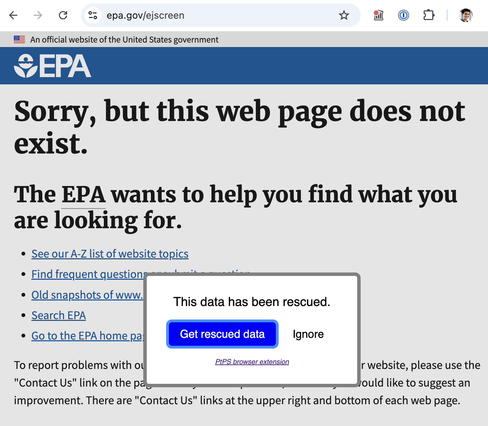

# Changelog

Only includes notable updates.

## 2026-09-24

- **Firefighter maps:** Put the firefighter map and the new simplified map together under "Firefighter maps", as [Detailed](https://investinopen.github.io/ptps-wildfire-demo/firefighter-maps/detailed/) and [Simplified](https://investinopen.github.io/ptps-wildfire-demo/firefighter-maps/simplified/). Links to their old addresses redirect.
- **[Simplified firefighter map](https://investinopen.github.io/ptps-wildfire-demo/firefighter-maps/simplified/):** Draw the roads around Gold Hill, Colorado as a graph, a simplified map for navigation: each road's length is proportional to its driving distance, colored by its steepest grade, with sharp turns, dead ends, gates, and addresses marked.

## 2026-09-23

- **[Firefighter map](https://investinopen.github.io/ptps-wildfire-demo/firefighter-map/):**
  - Color buildings by [CarbonPlan's Open Climate Risk](https://carbonplan.org/) score, with a four-color key.
  - Replace the fuel load and burn probability layers with a flame length hatch.
  - Add water sources, swimming pools, gates, dead ends, and bridge weight limits (in US tons).
  - Label every named road in view, and show route numbers as sign-style boxes that stay clear of buildings and house numbers.
  - Make roads near-black, and driveways and trails thicker and easier to see; hide sidewalks.
  - Move the legend, attribution, and scale into a collapsible sidebar, with the name of the town(s) in view, the place search, and an overview map.
  - Suggest places as you type in the search box.
  - Cache map data for offline use.
  - Upgraded to MapLibre 6, and added tests.
- [**Analysis:**](site/analysis/)
  - Show [what percentage of terminated federal datasets have been rescued](site/analysis/federal_data_terminations.ipynb).
  - Added titles and legends to the maps that were missing them.
- Documented [running the site locally](CONTRIBUTING.md).

## 2026-09-22

- [**Analysis:**](site/analysis/) The [risk](https://investinopen.github.io/ptps-wildfire-demo/analysis/risk.html) and [wildfire overlap](https://investinopen.github.io/ptps-wildfire-demo/analysis/fire-overlap.html) pages are now re-run daily, so the Red Flag Warnings and active fire detections stay current. Their input data is [stored in Git LFS](site/analysis/README.md#data).

## 2026-09-17

- **Wildfire risk map:** [Published a printable map](https://investinopen.github.io/ptps-wildfire-demo/firefighter-map/) meant to be handed to small/rural fire departments, combining building footprints, fuel load, fire hydrants, roads, driveways, and trails for an area.
  - Show a legend that doubles as the layer toggle, and highlight moderate/high fuel load risk with a hatch pattern.
  - Add a "search for a place" box, and make the current view linkable.
  - Add a disclaimer that it's a proof of concept and hasn't been validated.
  - Tune it for printing (keep the legend fills, hide the layer toggles) and for mobile.
- [**Analysis:**](site/analysis/)
  - [Rank a state's fire weather zones](site/analysis/risk.ipynb) by a composite of burn probability, burn history, active fire detections, and red flag warnings.
  - [Map every fire perimeter that's burned a state since 1984](site/analysis/fire_overlap.ipynb), using WUMI perimeters fetched from Dryad.
  - [Fuzzy-match terminated federal datasets](site/analysis/federal_data_terminations.ipynb) against Data Rescue Project rescues.
  - Show when the [dataset rescue status report](site/analysis/README.md#dataset-rescue-status-report) was generated, and fix a few example dataset URLs.
  - Consolidated the analysis documentation into [analysis/README.md](site/analysis/README.md).
- [**HTTP proxy:**](https://investinopen.github.io/ptps-wildfire-demo/fallbacks.html#http-proxy) Documented [QGIS and httpx usage](https://investinopen.github.io/ptps-wildfire-demo/fallbacks.html#proxy-usage) against the proxy, and made passive archiving more tolerant of slow sites.

## 2026-09-03 - status update

After some initial scoping conversations, we landed on a technical goal of "making it easier to work with rescued data." This has resulted in several sub-projects:

- Tools
  - [HTTP proxy](https://investinopen.github.io/ptps-wildfire-demo/fallbacks.html#http-proxy)
  - [Python package](https://investinopen.github.io/ptps-wildfire-demo/fallbacks.html#python-package)
  - [Browser extension](https://investinopen.github.io/ptps-wildfire-demo/fallbacks.html#browser-extension)
- [Analysis/dashboards](site/analysis/)
  - [Wildfire data](https://investinopen.github.io/ptps-wildfire-demo/analysis/rescue-status.html)
  - [Federal Data Terminations](site/analysis/federal_data_terminations.ipynb)

The tools are all centered around the same problem: when a source URL (file, webpage, etc.) becomes unavailable, how do you find a backup? The tools leverage these mappings to answer that question:

- Data Rescue Project — points to other repositories
- Wayback Machine — points to its own repository
- Possible add-ons:
  - [Common Crawl](https://github.com/investinopen/ptps-wildfire-demo/issues/8) — points to its own repository
  - [Radiant Earth project](https://docs.google.com/document/d/1YyXuWykSFSP9F7lcQrKp6uraAIKi45cdW6iCaNP-cV4/edit?tab=t.0) — will point to Source Cooperative / Dryad

While there are [a number of efforts to archive data](https://github.com/investinopen/ptps-wildfire-demo/issues/21), the Data Rescue Project is unique in that they're trying to comprehensively catalog rescues across repositories. Therefore, their mapping is valuable for connecting data users with the backups. The tooling that we've been working on takes that mapping and makes it easier to leverage.

All of this applies to data in any domain — it's not specific to wildfire. The question remains how we can best serve fire-related use cases.

### Possible directions

Here are some ideas of where we could go from here:

#### User research

This project was started with a hypothesis and input from others in the data platform/repository/rescue space, but we haven't communicated with \[potential\] users of that data. Doing some user research would help us:

- Understand current pain points, especially on the operational side
- See if what we've built already is useful

#### Expanding the mappings

The tools mentioned could be improved, but the core functionality is there. What would make them more and more valuable is expanding the mappings. We've suggested that the Data Rescue Project incorporate mappings from:

- [Public Environmental Data Partners (PEDP)](https://github.com/datarescueproject/portal/issues/27)
- [Sciop](https://github.com/datarescueproject/portal/issues/35)

Granted, this wouldn't be the most exciting demo, since it's essentially "we made the number go from ~4,900 to ~5,500!"

#### Data cleaning

[**@zaneselvans**](https://github.com/zaneselvans) [pointed out](https://docs.google.com/document/d/1x1ZY33IR7BbviMN0-uof_PZ63Lcxzarju9H5y2Ew4EQ/edit?tab=t.0#bookmark=id.oe49nq1ymqfg) that the source data is likely messy, and there could be value in creating curated/cleaned datasets. In other words, mirror what [Catalyst Cooperative](https://catalyst.coop/) is doing for energy data, but for wildfire-relevant data. Doing this well would require pulling in subject matter experts.

#### Data crawling

Most(?) data rescue efforts rely on proactive capture of specific datasets. In other words, someone needs to:

1. Identify a dataset that's at risk
2. Download it, manually or through a pipeline
3. Upload it to a repository

This raises the questions:

- What datasets have people not thought to back up?
- What got backed up once but isn't capturing updates?

This means there's likely a long tail of less-popular datasets that aren't getting captured.

By contrast, Internet Archive and Common Crawl cast a wide net, crawling the internet and then saving the content of URLs. That said, [it's unclear how interested they are in saving data (CSVs, Excel files, etc)](https://github.com/investinopen/ptps-wildfire-demo/issues/7). If they aren't, a project could be crawling for and archiving datasets. This would get ahead of source datasets being taken down quietly / by surprise.

This seems to be the direction [varve (the new Radiant Earth project)](https://github.com/tylere/varve) is going.

#### Passive archiving

As an alternative approach to active crawling: When using [the proxy](https://investinopen.github.io/ptps-wildfire-demo/fallbacks.html#http-proxy), it checks if the URL is available in the Internet Archive. If it's not, the proxy automatically triggers a capture. This **archives data that people are actively using, when they're using it**. This idea could be expanded:

- [Automatically saving data to other repositories](https://github.com/investinopen/ptps-wildfire-demo/issues/11) (that are more data-focused)
- Assigning DOIs
- etc.

#### Maps/data for firefighters

> There is very little data analysis in emergency management and the fire service, and relatively little technical expertise. Nobody writes code. I don't lament that fact, I think it's awesome. In essence the role of Emergency Management during an emergency is to create and support a human decision-making and information dissemination machine (called an Incident Command Structure) that is not reliant on digital technologies.

–Dennis, volunteer firefighter / emergency manager in Colorado

They don't even use GPS for navigation. He sent a picture of their map binder, which was dated 2011. Unclear if:

- Using old maps is a problem for them
- When/how the maps get updated
- They use any other reference information ("data") related to fires

[Watch Duty](https://www.watchduty.org/solutions/overview) is a player in this space, though presumably with a focus on digital. Presumably there are others.

There may be an opportunity to provide more / better / up-to-date information to \[small\] fire departments, which might take the form of PDFs they can print.

### Recommendations

Our theory is that researchers are interested in:

- Stability
- Identifiers
- Privacy
- Sovereignty

…while operational folks (firefighters, etc.) _just want the data_, lowest friction possible. If at all.

**"Could we make firefighters better paper maps?"** is interesting — very different from other other data rescue efforts, yet data rescue/resilience nonetheless.

The [**passive archiving**](#passive-archiving) also seems to be unique. The flip side of it, [**data crawling**](#data-crawling), may already be happening through other archival projects, but that data isn't surfaced. If it isn't happening, that could be a gap to fill.

All that said, the best way to know what users want it is to talk to them 🙂 Pull quotes from firefighters and emergency managers would be a compelling part of any pitch.

## 2026-08-31

- [**Browser extension:**](https://investinopen.github.io/ptps-wildfire-demo/fallbacks.html#browser-extension) Introduced the extension, linking matched pages to the [Data Rescue Project Portal](https://portal.datarescueproject.org/datasets/) through a modal overlay.

  

- [**HTTP proxy:**](https://investinopen.github.io/ptps-wildfire-demo/fallbacks.html#http-proxy)
  - Look for archives of redirect URLs, when archives of the original aren't available.
  - Respond with JSON when appropriate.
  - Introduce "passive archiving", saving the URL to the [Internet Archive](https://archive.org/) if the request is a GET and the URL isn't archived there already.
    - This pattern can be expanded to save data to other repositories, such as [Dryad](https://datadryad.org/) / [Source Cooperative](https://docs.source.coop/data-upload).
  - Improved URL matching.
  - Improved error handling.
- [**Analysis:**](site/analysis/) Expanded the wildfire dataset status analysis.
  - Include [all datasets](site/analysis/fire_datasets.csv) that don't require authentication.
  - Display the source and rescue status of each data URL and webpage. This is meant to mimic the status dashboard from [**@jring-o**'s prototype](https://github.com/jring-o/scsd).
  - [Publish a report to GitHub Pages.](site/analysis/README.md#dataset-rescue-status-report)

## 2026-08-24

- [**HTTP proxy:**](https://investinopen.github.io/ptps-wildfire-demo/fallbacks.html#http-proxy) Find rescued data in the [Data Rescue Project](https://portal.datarescueproject.org/datasets/) and [Wayback Machine](https://web.archive.org/).
- [**Analysis:**](site/analysis/)
  - Show the rescue status of the wildfire datasets.
  - [Show the statuses of the source URLs archived by the Data Rescue Project.](site/analysis/rescues.ipynb)

## 2026-08-20

- [**HTTP proxy:**](https://investinopen.github.io/ptps-wildfire-demo/fallbacks.html#http-proxy) Introduced the [mitmproxy](https://www.mitmproxy.org/) fallback addon. [Demo.](https://drive.google.com/file/d/1IuWQqmfLEJsdH916C8GE9MWRktg6EKA9/view?usp=drivesdk)

## 2026-08-10

- [**Analysis:**](site/analysis/) Started [working with wildfire risk data](site/analysis/risk.ipynb).
  - Established a DuckDB- and notebook-based workflow for wildfire, burn-probability, active-fire, and climate-risk data.
  - Added nationwide risk and burn-probability visualizations, including state boundaries and red-flag alerts.

## 2026-07-29

- Initialized the project.
