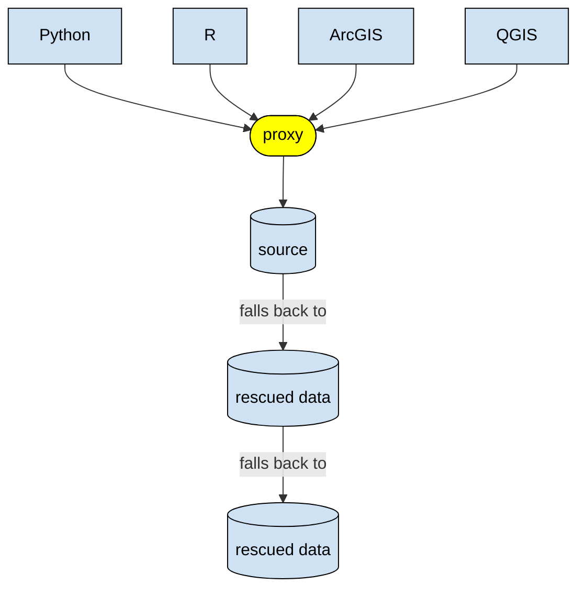

# PtPS Wildfire Demo

A networked data infrastructure demo for the "Investing in Open Infra to Safeguard Critical Scientific Data" project. Essentially, we are **making it easier to work with rescued data**.

PtPS is the Portfolio to Protect Science.

## Background

We are losing critical scientific knowledge every day. Urgent and increasing threats from funding cuts and policy changes impact the core datasets relied on globally for climate forecasting, public health, research, and scientific discovery.

To date, efforts to stop this loss have been primarily oriented toward rescue and preservation activities: saving bytes, archiving repositories, and migrating at-risk content to academic and non-profit storage environments and/or to commercial cloud providers. These crucial, often grassroots, efforts have been challenged by existing inefficiencies, fragmentation, and siloing across disconnected repositories and services. They may also inadvertently reinforce these problems by addressing immediate data loss, but not providing an alternate scenario for promoting long-term access continuity.

What is almost entirely absent in the projects and initiatives we are tracking is investment in the technical infrastructure layer: the tools, pipelines, standards, systems, and people that make any of the other work durable.

The project will design, build, and document a working end-to-end data infrastructure proof of concept organized around a specific use case: wildfire and disaster identification, prevention, and response. We have selected a fire and disaster relief scenario as our anchor case because it requires data across multiple disciplines including weather, GIS, health markers, environment and more, demonstrating the cross-domain assembly problem while connecting to urgent societal stakes that make visceral the "what happens if this goes dark" argument.

## Fallbacks

When source data (from a government, etc.) gets taken down, this can stop its users dead in their tracks. Sometimes the data has been rescued by a third party, but it’s not always easy to find, use, or comprehend. This project aims to make that simpler, providing a “fallback” behavior when original data sources aren’t available. Essentially, we want to save data users from digging through the [Data Rescue Project (DRP) Portal](https://portal.datarescueproject.org/datasets/), if they even know to look for it.

## Use cases

### User groups

For this phase of the project, we are targeting the following user groups:

- Researchers
- Operational people
  - Emergency managers
  - Fire departments

### Tools

We aim to support the following tools:

- Python
- R
- ArcGIS
- QGIS
- Nice-to-haves:
  - DuckDB
  - PostgreSQL/PostGIS

## Design decisions

- Focus on low-velocity/historical data rather than high-velocity/real-time
- Focusing on mirrors (direct copies), rather than fabricating new datasets / creating alternatives
- Presenting rescued/identical data as-is rather than doing any cleaning
- Shouldn’t be reliant on specific cloud providers
- While this is being built as a compatibility layer (behind the scenes), we will surface source dataset status and fallbacks to make it easier for people to understand.

We acknowledge that those other areas are valuable, they just aren’t in scope for this (phase of the) project.

## [HTTP proxy](proxy/)

The fallback behavior is available through a proxy, retrieving source data that's available or letting you know where to find data that's missing. The proxy will also passively archive URLs in the [Internet Archive](https://archive.org/) if they don't already exist there, preventing any future situation where a dataset disappears.

### Architecture



### Usage

✅ **Implemented**

1. Install dependencies:
   - Python
   - [uv](https://docs.astral.sh/uv/getting-started/installation/)
1. Install Python dependencies:

   ```sh
   uv sync
   ```

1. Optional: Set up credentials for the Internet Archive. This avoids rate limits.
   1. [Get credentials.](https://archive.org/developers/tutorial-get-ia-credentials.html)
   1. Create environment variables file.

      ```sh
      cp .env.sample .env
      ```

   1. Fill out that file.

1. [Start the proxy.](https://docs.mitmproxy.org/stable/overview/getting-started/#launch-the-tool-you-need)

   ```sh
   uv run mitmdump -s ptps_wildfire_demo/proxy/fallback.py
   ```

1. In another terminal, [install the certificate](https://docs.mitmproxy.org/stable/concepts/certificates/#installing-the-mitmproxy-ca-certificate-manually).

   ```sh
   curl --proxy 127.0.0.1:8080 --cacert ~/.mitmproxy/mitmproxy-ca-cert.pem https://example.com/
   ```

1. Connect from [a supported tool](#tools) — see [demo notebook](proxy/demo.ipynb).
   - Instructions for the others to come.

## ~~DuckDB extension~~

The proxy / Python package can be used instead.

## Python package

⚠️ **Planned**

## [Browser extension](extension/)

✅ **Implemented**

### Usage

It's recommended that you use this alongside the [official Internet Archive Wayback Machine extension](https://web.archive.org/).

1. Install dependencies:
   - [Node.js](https://nodejs.org/)
1. Install npm dependencies:

   ```sh
   cd extension
   npm install
   ```

1. Build the extension:

   ```sh
   npm run build
   ```

1. Load the unpacked extension from `extension/dist/` into your browser:
   - Chrome/Edge: `chrome://extensions` → enable "Developer mode" → "Load unpacked" → select `extension/dist/`
   - Firefox: `about:debugging#/runtime/this-firefox` → "Load Temporary Add-on" → select `extension/dist/manifest.json`

### Development

- `npm run watch` — rebuild on file changes
- `npm run typecheck` — type-check without emitting
- `npm test` — run the test suite (hits live network endpoints, mirroring the [proxy](proxy/)'s Python tests)

## See also

- [The Data Resilience Funding Landscape: A Preliminary Analysis](https://investinopen.org/blog/data-resilience-funding-landscape/)
- [Protype app from **@jring-o**](https://github.com/jring-o/scsd)
