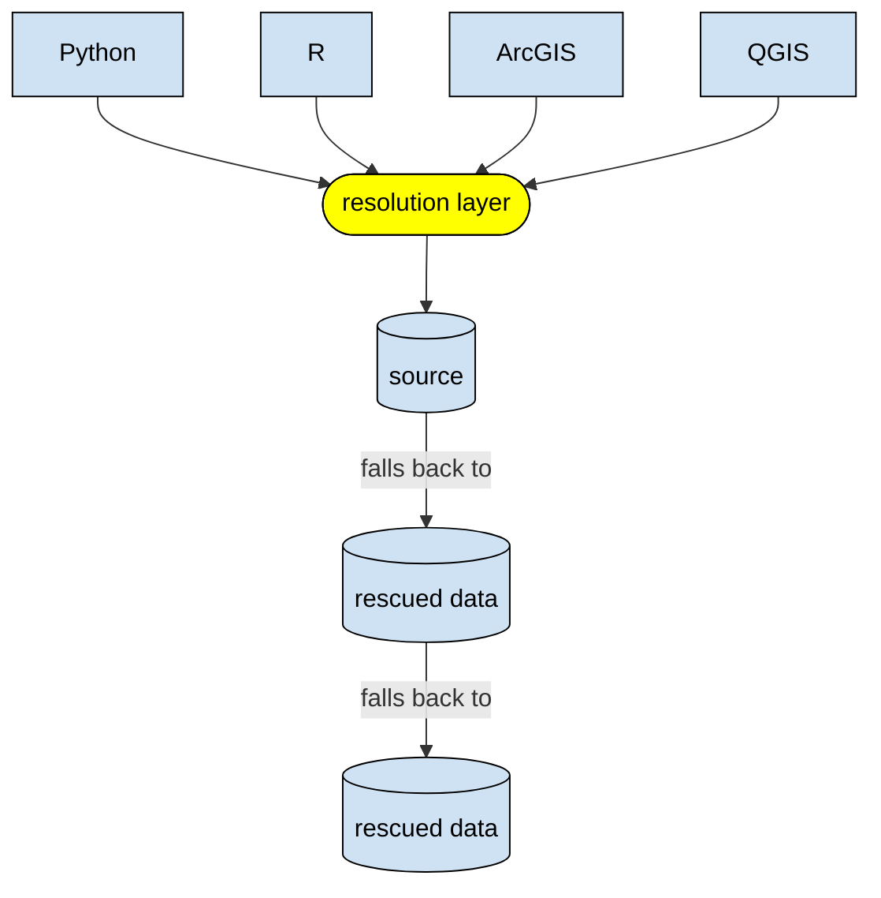

# ptps-wildfire-demo

A networked data infrastructure demo for the "Investing in Open Infra to Safeguard Critical Scientific Data" project. There are a couple explorations happening in parallel — see the headings below.

## Analysis

Requires [DuckDB](https://duckdb.org/).

For Python dependencies managed with `uv`, use a regular CPython build (for example `3.14.6`), not a free-threaded build (for example `3.14.6t` / `3.14.6+freethreaded`). Some binary packages used by this project (such as `lonboard` -> `geoarrow-rust-core`) do not currently publish free-threaded wheels.

1. [Download the burn probability data.](burn_prob.ipynb)
1. [Run the analysis.](risk.ipynb)

## Fallback

_This is being written as [documentation-driven development](https://gist.github.com/zsup/9434452). In other words, this functionality doesn't exist yet._

**Tagline:** Making it easier to work with rescued data.

When source data (from a government, etc.) gets taken down, this can stop its users dead in their tracks. Sometimes the data has been rescued by a third party, but it’s not always easy to find, use, or comprehend. This project aims to make that simpler, providing a “fallback” behavior when original data sources aren’t available. Essentially, we want to save data users from digging through the [Data Rescue Project (DRP) Portal](https://portal.datarescueproject.org/datasets/), if they even know to look for it.

### Background

We are losing critical scientific knowledge every day. Urgent and increasing threats from funding cuts and policy changes impact the core datasets relied on globally for climate forecasting, public health, research, and scientific discovery.

To date, efforts to stop this loss have been primarily oriented toward rescue and preservation activities: saving bytes, archiving repositories, and migrating at-risk content to academic and non-profit storage environments and/or to commercial cloud providers. These crucial, often grassroots, efforts have been challenged by existing inefficiencies, fragmentation, and siloing across disconnected repositories and services. They may also inadvertently reinforce these problems by addressing immediate data loss, but not providing an alternate scenario for promoting long-term access continuity.

What is almost entirely absent in the projects and initiatives we are tracking is investment in the technical infrastructure layer: the tools, pipelines, standards, systems, and people that make any of the other work durable.

The project will design, build, and document a working end-to-end data infrastructure proof of concept organized around a specific use case: wildfire and disaster identification, prevention, and response. We have selected a fire and disaster relief scenario as our anchor case because it requires data across multiple disciplines including weather, GIS, health markers, environment and more, demonstrating the cross-domain assembly problem while connecting to urgent societal stakes that make visceral the "what happens if this goes dark" argument.

### Use cases

For this phase of the project, we are targeting the following user groups:

- Researchers
- Operational people
  - Emergency managers
  - Fire departments

We aim to support the following tools:

- Python
- R
- ArcGIS
- QGIS
- Nice-to-haves:
  - DuckDB
  - PostgreSQL/PostGIS

### Design decisions

- Focus on low-velocity/historical data rather than high-velocity/real-time
- Focusing on mirrors (direct copies), rather than fabricating new datasets / creating alternatives
- Presenting rescued/identical data as-is rather than doing any cleaning
- Shouldn’t be reliant on specific cloud providers
- While this is being built as a compatibility layer (behind the scenes), we will surface source dataset status and fallbacks to make it easier for people to understand.

We acknowledge that those other areas are valuable, they just aren’t in scope for this (phase of the) project.

### Architecture



### Usage

Considering the following options for the resolution layer:

#### Option 1: HTTP proxy

1. [Install mitmproxy.](https://docs.mitmproxy.org/stable/overview/installation/)
1. [Start the proxy.](https://docs.mitmproxy.org/stable/overview/getting-started/#launch-the-tool-you-need)

   ```sh
   mitmdump
   ```

1. In other terminal, test the proxy.
   - cURL

     ```sh
     curl -i -x http://localhost:8080 http://mitm.it/
     ```

   - Python

     ```sh
     uv run python proxy/test.py
     ```

#### Option 2: DuckDB extension

#### Option 3: Python package

## See also

- [Protype app from **@jring-o**](https://github.com/jring-o/scsd/tree/main)
